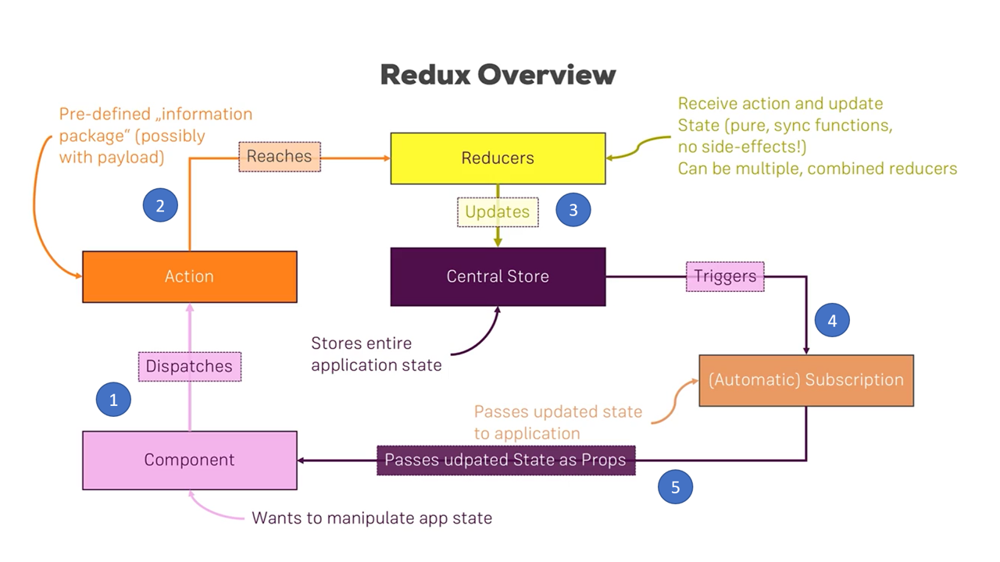

##About
React Native Application for Awesome Places - Udemy Course

## Required

| Software        | Version  |
|-----------------|----------|
| NodeJS          | > 8.0    |
| React-Native    | 0.5xxxx  |
| Xcode  | 10.2   |          |
| Android Studio  | xxxx     |

##Install

##Some Few usefull develipment Comamnds
react-native run-ios --simulator="iPhone 8"

export _JAVA_OPTIONS=-Djava.net.preferIPv4Stack=true

/Users/abib/Library/Android/sdk/emulator/emulator -avd Pixel_API_27 -netdelay none -netspeed full &

## Reference for install & Configure -> React Native Navigation package (version 1)
Navigation v1
https://medium.com/handlebar-labs/getting-started-with-react-native-navigation-v1-7a16afdeadcd

##Redux

